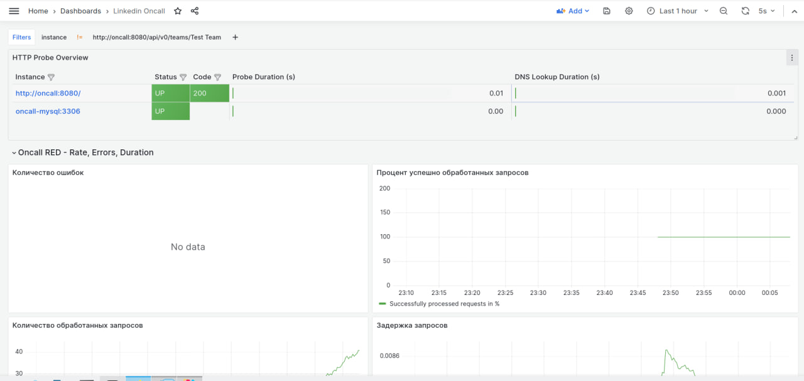

# LinkedIn OnCall полностью покрытый Observability
Форк сервиса LinkedIn OnCall для управлением дежурств, покрытый мониторингом. Домашние задания по курсу SRE в Тинькофф Академии

## Что было сделано

- [X] Сбор метрик в Prometheus с docker service discovery
- [X] Кастомный экспортер со сбором бизнес метрик (/monitoring/duty_exporter)
- [X] Blackbox Exporter, Node exporter, CAdvisor
- [X] Спроектированы и замониторены SLI, SLO, SLA
- [X] Развернут и настроен стэк для сборки логов ELK
- [X] Развернута Grafana, настроены дашборды, покрывающие SLI, SLO, SLA системы, RED и USE метрики, логи (
  /monitoring/dashboards)
- [X] Настроены алерты в телеграм
- [X] Round Robin балансировка двух нод через nginx, покрытие его метриками
- [X] Скрипт с бесшовным обновлением OnCall

## Скрины с дашбордами

| System Summary                             |
|--------------------------------------------|
|  |
| **Oncall Dashboard**                       |
|            |
|            |
|            |
|            |
